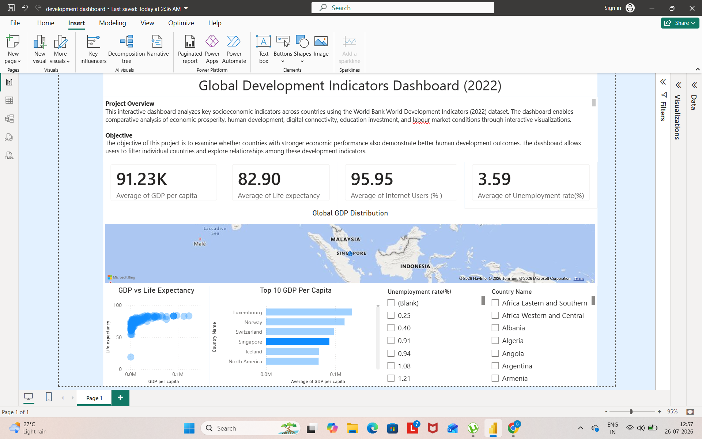

# 🌍 Global Socioeconomic Development Dashboard (World Bank 2022)

## Project Overview

This project presents an interactive Power BI dashboard developed using the World Bank World Development Indicators (2022) dataset. The dashboard enables users to explore socioeconomic development across countries by analyzing key economic and social indicators.

---

## Objectives

The project aims to:

- Compare GDP per capita across countries
- Explore the relationship between income and life expectancy
- Analyze internet penetration and unemployment rates
- Enable interactive country-level exploration through filters and visualizations

---

## Dataset

**Source:** World Bank – World Development Indicators (2022)

Indicators used:

- GDP per Capita
- Life Expectancy
- Internet Users (% of Population)
- Government Expenditure on Education (% of GDP)
- Unemployment Rate

---

## Tools Used

- Power BI Desktop
- Power Query
- Data Cleaning
- Data Transformation
- Interactive Dashboard Design

---

## Dashboard Features

- KPI Cards
- Interactive World Map
- Scatter Plot
- Bar Chart
- Country Slicer

---

## Key Insights

- Higher GDP per capita is generally associated with higher life expectancy.
- Countries with greater internet penetration tend to be economically more developed.
- Unemployment rates vary considerably even among countries with similar income levels.
- Development outcomes are multidimensional and cannot be explained solely by GDP.

---

## Dashboard Preview



---

## Skills Demonstrated

- Power BI
- Power Query
- Data Cleaning
- Data Visualization
- Dashboard Design
- Socioeconomic Data Analysis
- Business Intelligence

---

## Repository Structure

```
global-development-dashboard/
│
├── data/
├── images/
├── Global_Development_Dashboard.pbix
└── README.md
```

---

## Author

**Gargi Dey**

M.Sc. Economics (Data Analytics)

Symbiosis School of Economics